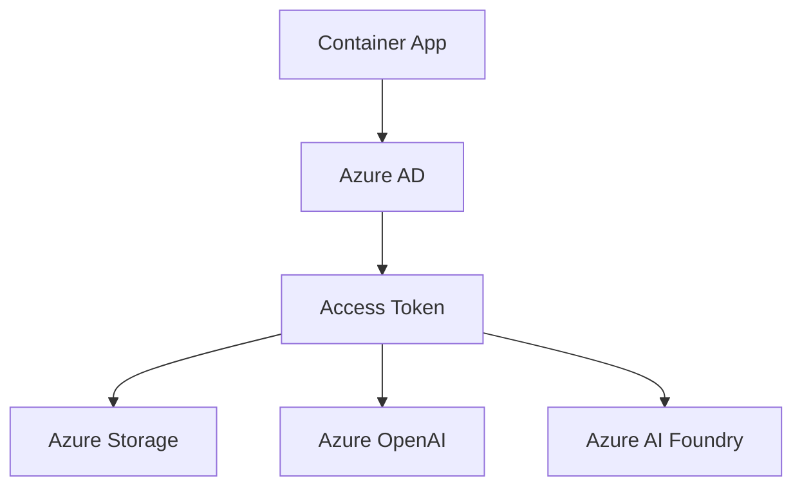

# Managed Identity Configuration Guide

This document explains how the evaluation engine uses Azure Managed Identity for secure, keyless authentication to Azure services.

## Overview

The evaluation engine uses **System-Assigned Managed Identity** to authenticate with:
- **Azure Storage** (queues and blobs)  
- **Azure OpenAI** (AI model inference)
- **Azure AI Foundry** (evaluation framework)

## Benefits

✅ **No secrets management** - No connection strings or API keys to store  
✅ **Automatic credential rotation** - Azure handles token lifecycle  
✅ **Enhanced security** - Reduces credential exposure risk  
✅ **Simplified deployment** - No manual credential configuration  

## How It Works

### 1. System-Assigned Managed Identity

```json
{
  "identity": {
    "type": "SystemAssigned"
  }
}
```

When deployed, Azure automatically:
- Creates a managed identity for the Container App
- Assigns a unique Principal ID
- Provides automatic token management

### 2. RBAC Role Assignments

The managed identity needs specific roles:

**Azure Storage:**
- `Storage Queue Data Contributor` - Read/write queue messages
- `Storage Blob Data Contributor` - Upload evaluation results

**Azure OpenAI:**
- `Cognitive Services OpenAI User` - Access AI models

### 3. Authentication Flow



1. Container App requests token from Azure AD
2. Azure AD validates managed identity
3. Returns access token
4. App uses token to access Azure services

## Configuration

### Environment Variables

The app automatically detects managed identity through these environment variables:

```bash
# Managed Identity Configuration
AZURE_USE_MANAGED_IDENTITY=true
AZURE_TENANT_ID=72f988bf-86f1-41af-91ab-2d7cd011db47
AZURE_SUBSCRIPTION_ID=d2ef7484-d847-4ca9-88be-d2d9f2a8a50f

# Azure Storage (no connection string needed)
AZURE_STORAGE_ACCOUNT_NAME=mystorageaccount
AZURE_QUEUE_NAME=evaluation-requests

# Azure OpenAI (no API key needed)
AZURE_OPENAI_ENDPOINT=https://evalplatform.cognitiveservices.azure.com/
AZURE_OPENAI_DEPLOYMENT_NAME=gpt-4.1
AZURE_OPENAI_USE_MANAGED_IDENTITY=true
```

### Application Code

The application uses `DefaultAzureCredential` which automatically detects managed identity:

```python
from azure.identity.aio import DefaultAzureCredential
from azure.storage.queue.aio import QueueServiceClient

# Automatically uses managed identity when available
credential = DefaultAzureCredential()
account_url = f"https://{storage_account}.queue.core.windows.net"
service_client = QueueServiceClient(account_url=account_url, credential=credential)
```

## Deployment Steps

### 1. Deploy Container App

```powershell
.\deploy.ps1
```

This creates the Container App with system-assigned managed identity.

### 2. Assign RBAC Roles

```powershell
.\assign-rbac-roles.ps1 -StorageAccountName "mystorageaccount" -SubscriptionId "your-subscription-id"
```

This assigns the required permissions to the managed identity.

### 3. Verify Configuration

```powershell
# Check managed identity
az containerapp show --name eval-framework-app --resource-group rg-sxg-agent-evaluation-platform --query identity

# Check role assignments
az role assignment list --assignee <principal-id> --output table
```

## Troubleshooting

### Common Issues

**1. Access Denied Errors**
```
DefaultAzureCredential failed to retrieve a token from the managed identity endpoint
```

**Solution:** Ensure RBAC roles are assigned correctly.

**2. Storage Account Not Found**
```
The specified storage account does not exist
```

**Solution:** Verify `AZURE_STORAGE_ACCOUNT_NAME` environment variable.

**3. OpenAI Access Denied**
```
Access denied to Azure OpenAI resource
```

**Solution:** Assign `Cognitive Services OpenAI User` role.

### Debugging Commands

```bash
# Check managed identity status
az containerapp show --name eval-framework-app --resource-group rg-sxg-agent-evaluation-platform --query identity.principalId

# List role assignments
PRINCIPAL_ID="<managed-identity-principal-id>"
az role assignment list --assignee $PRINCIPAL_ID --output table

# Test storage access
az storage queue list --account-name mystorageaccount --auth-mode login

# Test OpenAI access
az cognitiveservices account show --name evalplatform --resource-group rg-sxg-agent-evaluation-platform
```

## Local Development

For local development, managed identity won't work. Use these alternatives:

### Option 1: Azure CLI Authentication

```bash
az login
# App will use your Azure CLI credentials
```

### Option 2: Connection String (Fallback)

Set environment variable:
```bash
AZURE_STORAGE_CONNECTION_STRING="DefaultEndpointsProtocol=https;AccountName=..."
AZURE_USE_MANAGED_IDENTITY=false
```

## Security Best Practices

1. **Principle of Least Privilege:** Only assign required roles
2. **Resource Scoping:** Limit role assignments to specific resources
3. **Regular Audits:** Review role assignments periodically
4. **Monitor Access:** Enable logging for managed identity usage

## Resources

- [Azure Managed Identity Documentation](https://docs.microsoft.com/en-us/azure/active-directory/managed-identities-azure-resources/)
- [Container Apps Managed Identity](https://docs.microsoft.com/en-us/azure/container-apps/managed-identity)
- [Azure RBAC Roles](https://docs.microsoft.com/en-us/azure/role-based-access-control/built-in-roles)